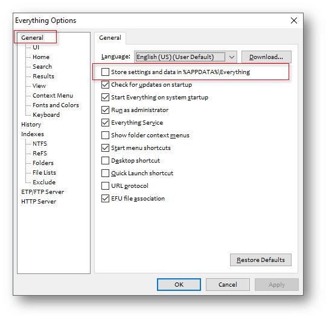
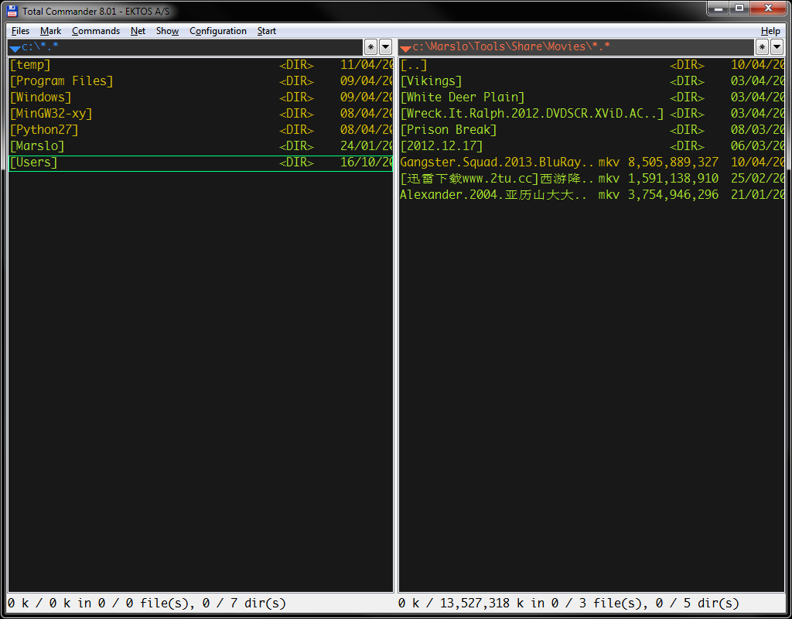

ViATc_Everything
================

The configurations about ViAtc(TC) AND Everything

# Total Command (+ViATc):
## File Location:
- Copy the foler **GHISLER** from **Roaming** to `%APPDATA%`
- Copy the files under the foler **totalcmd** to the TC installation folder (C:\Program Files\totalcmd)

## ViATc Settings
- Input `:setting`

## Customized Shortcuts:
- <kbd>e</kbd>: Edit file
- **h**: Go to Parent foler
- <del>**l**: Enter</del>
- **gr**: Go to Root foler (c:\)
- **F2**: Rename Signle file
- **F4**: Open Context Menu
- **Ctrl + F**: Search file
- **Shift + Ctrl + F**: Search file by Everything
- **Alt + D**: Select the current folder path

# Everything:
## File localtion:
## PLEASE BACKUP YOUR CONFIG FILE FIRST!

First of all, open `Everything Application` -> `Tools` -> `Options...`. OR  **Ctrl + P** check as below:

- If CHECK Store settings and data in %APPDATA%\Everything, this is the default setting, then

  Copy `everything\APPDATA\Everything\Everything.ini` to `%APPDATA%\Everything`

- If NOT-CHECK this check box, then

  Copy `everything\MyProgrammes\Everything\Everything.ini` to everything installation folder (e.g.: C:\Program Files\Everything)

## Customized Shortcuts:
- <del>**Alt + a**: trigger</del>
- **F1**: trigger

# Screenshots:
## Total Command

## Everything

